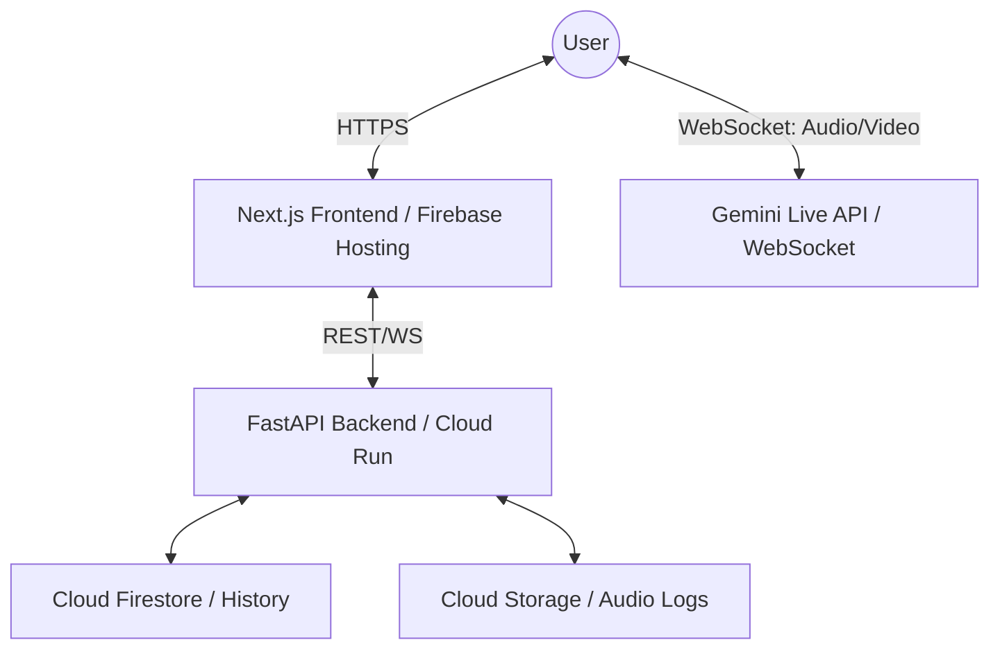

# Northstack: Real-Time Multimodal AI Coach 🗣️👁️

Northstack is a premium, voice-first AI platform built for the **Gemini Live Agent Challenge**. It features a specialized **Live Accent Coach** that uses Gemini 2.5 Flash to provide real-time, interruptible feedback on pronunciation, prosody, and physical articulation using webcam vision.


## ✨ Core Features

- **Gemini Live Integration**: Native support for `gemini-2.5-flash-native-audio-preview-12-2025` via direct WebSockets.
- **Visual Articulation Coaching**: Uses MediaPipe to track facial landmarks and hand gestures, providing visual cues for correct speech production.
- **Interruptible Conversation**: Natural, flow-of-consciousness interaction—just start speaking to interrupt the agent.
- **Multimodal Feedback**: Agent responds with high-fidelity audio while rendering visual aids (HTML/SVG) in the sidebar.
- **Premium UI**: Glassmorphic, dark-mode-first interface optimized for focus and accessibility.

## 🏗️ Architecture



## 🚀 Quick Start

### 1. Prerequisites
- Node.js 18+
- Python 3.10+
- Google Cloud Project with Gemini API enabled.

### 2. Backend Setup
```bash
cd backend
python -m venv .venv
source .venv/bin/activate  # or .venv\Scripts\activate on Windows
pip install -r requirements.txt
cp .env.example .env
# Fill in your GOOGLE_API_KEY and GCP_PROJECT_ID
uvicorn main:app --reload --port 8000
```

### 3. Frontend Setup
```bash
cd frontend
npm install
cp .env.local.example .env.local
# Fill in your NEXT_PUBLIC_GEMINI_API_KEY
npm run dev -p 3001
```
Open [http://localhost:3001](http://localhost:3001) in your browser.

## 🌐 Deployment

Deployment is automated via our root `deploy.sh` script.

```bash
chmod +x deploy.sh
./deploy.sh
```
See our [GCP Deployment Proof](docs/GCP_PROOF.md) for details on our cloud infrastructure and automation.
This script handles:
1. Building the backend Docker image via Cloud Build.
2. Deploying to Cloud Run.
3. Building the Next.js frontend with the new backend URL.
4. Deploying to Firebase Hosting.

## 🎥 Demo Video Guide
Check out the [Demo Guide](docs/demo_guide.md) for script outlines and key features to highlight in your submission.

---
Built with ❤️ by Northstack Team for the Gemini Live Agent Challenge.
