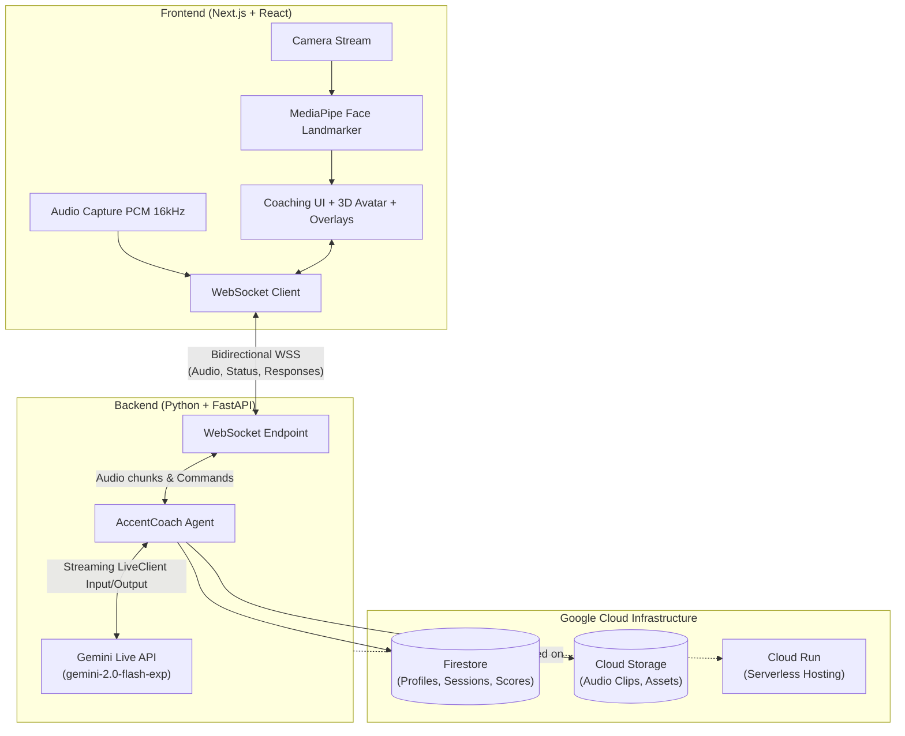

# Northstack Architecture

## High-Level Architecture Diagram
This diagram illustrates the real-time flow of audio and visual data between the frontend Next.js application, the backend FastAPI server, the Gemini Live API, and underlying Google Cloud infrastructure.

## Description
1. **Frontend**: A Next.js application captures real-time video using MediaPipe for face and mouth shape (blendshapes) tracking, and audio for speech evaluation. It maintains a stateful WebSocket connection to the backend.
2. **Backend**: FastAPI streams the bidirectional audio leveraging the `google-genai` Live API connection. The python script handles session orchestration asynchronously using separate send and receive queues. 
3. **Data**: Session scores and performance statistics are persisted to Firestore, allowing users to track their accent improvement over time.
